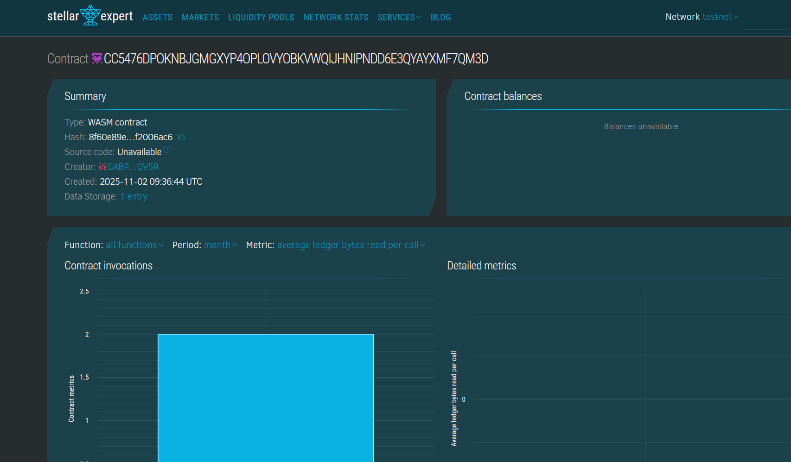

# QuizLumen — Decentralized Quiz dApp

## What is QuizLumen?

QuizLumen is a decentralized quiz platform that lets users create, share, and run quizzes with optional on-chain registration fees and prize distribution. The frontend is a React application (Create React App) and the smart contract is implemented in Rust using the Soroban SDK on the Stellar network (testnet).

Key ideas:
# QuizLumen — Decentralized Quiz dApp

## Project Description

QuizLumen is a decentralized quiz platform combining a React frontend and a Soroban smart contract on the Stellar testnet. It allows creators to author quizzes, share them with users, and optionally require on-chain registration fees that feed into a prize pool distributed to top performers.

The core system includes:
- A React-based frontend (`frontend/`) with a Quiz Creator, Quiz Interface, and WalletConnect integration for Freighter.
- A Soroban smart contract (Rust) (`smart-contract/quiz-contract/contracts/quiz-contract`) that stores quiz state, registrations, scores, and winner calculation logic.

## Project Vision

Make creating and running quizzes simple, transparent, and verifiable by leveraging blockchain for state and prize distribution. We want to:

- Empower creators to run community-driven quizzes with optional monetary incentives.
- Provide trustless, auditable prize distribution so winners are paid automatically according to contract logic.
- Offer an approachable developer experience to extend and integrate the quizzes into other apps and sites.

## Key Features

- Create, import and share quizzes from the browser.
- Optional on-chain registration with token/fee support and a prize pool.
- Submit answers (client-side hashed) and store scores on-chain.
- Leaderboard retrieval and simple winner selection & prize distribution.
- Frontend wallet integration with Freighter for signing transactions.

## Architecture

- Frontend: React (Create React App) in `frontend/` — components for quiz creation, playing, and wallet connection.
- Contract: Rust + Soroban in `smart-contract/quiz-contract/contracts/quiz-contract` — core quiz state and payout logic.
- Tooling: `soroban` CLI for building and deploying WASM artifacts to testnet.
- Persistence: quiz templates saved in `localStorage`, shareable via `?quiz=` URL.

## Deployed Contract (testnet)

- Contract ID: `CC5476DPOKNBJGMGXYP4OPLOVYOBKVWQIJHNIPNDD6E3QYAYXMF7QM3D`
- Explorer: https://stellar.expert/explorer/testnet/contract/CC5476DPOKNBJGMGXYP4OPLOVYOBKVWQIJHNIPNDD6E3QYAYXMF7QM3D
- 

## Quickstart — Development

Prerequisites:

- Node.js & npm
- Rust toolchain (rustup)
- `soroban` CLI (per Stellar docs)

Run the frontend:

```powershell
cd E:\QuizLumen\frontend
npm install
npm run dev
```

Build the contract:

```powershell
cd E:\QuizLumen\smart-contract\quiz-contract
soroban contract build --package quiz-contract --out-dir artifacts
```

Deploy (example):

```powershell
soroban keys generate mykey
soroban keys public-key mykey
curl "https://friendbot.stellar.org?addr=<G_ADDRESS>"  # fund
soroban contract deploy --network testnet --wasm artifacts\quiz_contract.wasm --source mykey
```

## Testing the contract (CLI)

```powershell
soroban contract invoke --id <CONTRACT_ID> --network testnet --source mykey -- get_quiz_state
soroban contract invoke --id <CONTRACT_ID> --network testnet --source mykey -- get_leaderboard
```

If `get_quiz_state` returns `Pending`, initialize the contract as admin:

```powershell
soroban contract invoke --id <CONTRACT_ID> --network testnet --source mykey -- initialize --admin <ADMIN_G_ADDRESS> --fee-amount 0 --fee-token <TOKEN_G_ADDRESS>
```

## Troubleshooting

- Wallet not connecting: open the app in the same browser profile with Freighter installed and unlocked. The connect flow must originate from a user gesture to avoid popup blockers.
- Leaderboard errors: convert SDK Vec/Map return values to plain JS arrays before mapping in components.

## Files of interest

- `frontend/src/components/WalletConnect.js` — wallet detection & connect UI
- `frontend/src/components/QuizCreator.js` — quiz authoring and upload
- `frontend/src/components/QuizInterface.js` — quiz runtime & leaderboard
- `frontend/src/services/contractService.js` — contract calls and normalization helpers
- `smart-contract/quiz-contract/contracts/quiz-contract/src/lib.rs` — Soroban contract implementation


# QuizLumen
