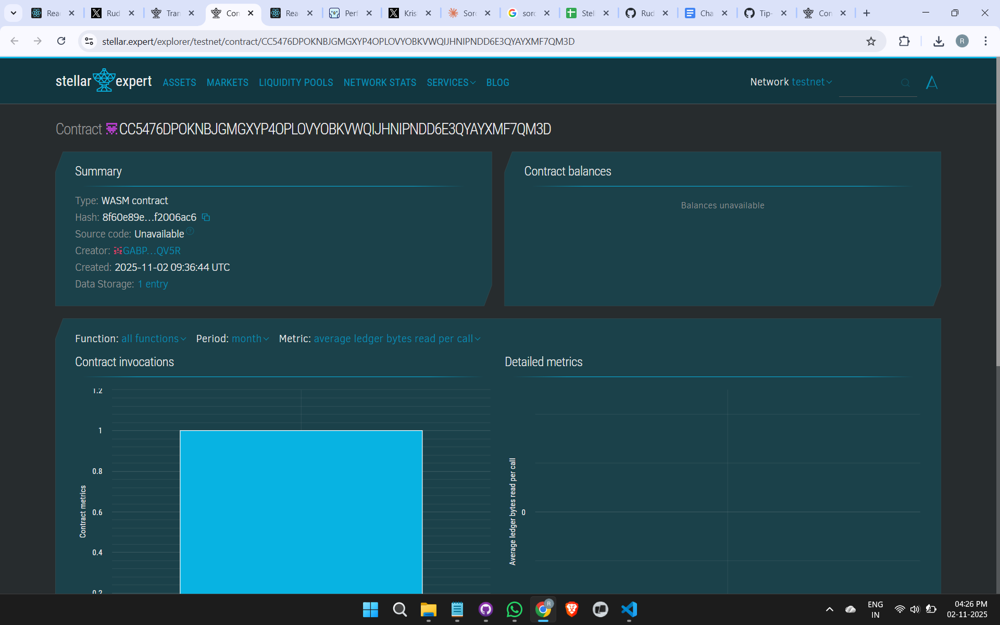

# QuizLumen

## Project Title
**QuizLumen** - Decentralized Quiz Platform on Stellar Blockchain

## Project Description
QuizLumen is a revolutionary decentralized quiz competition platform built on the Stellar blockchain using Soroban smart contracts. Participants can compete in quizzes by paying an entry fee through Freighter wallet integration. The smart contract automatically manages the prize pool and distributes rewards to the top 3 winners in a transparent and trustless manner.

The platform eliminates intermediaries, ensures fair prize distribution, and provides complete transparency through blockchain technology. All transactions are immutable and verifiable on the Stellar network.

## Project Vision
Our vision is to create a globally accessible, fair, and transparent quiz competition ecosystem where:

- **Transparency is paramount**: Every transaction and score is recorded on-chain
- **Trust is built-in**: Smart contracts eliminate the need for trusted intermediaries
- **Global participation**: Anyone with internet access can compete regardless of location
- **Instant settlements**: Winners receive their prizes automatically through smart contracts
- **Community-driven**: Decentralized governance allows participants to shape the platform's future

We aim to revolutionize online quiz competitions by leveraging blockchain technology to ensure fairness, transparency, and instant prize distribution, making competitive learning accessible to everyone worldwide.

## Key Features

### 1. **Decentralized Entry System**
- Participants register by paying an entry fee through Freighter wallet
- All entry fees are pooled securely in the smart contract
- Transparent tracking of total prize pool in real-time

### 2. **Automated Prize Distribution**
- Smart contract automatically distributes prizes to top 3 winners
- Prize allocation: 50% to 1st place, 30% to 2nd place, 20% to 3rd place
- No manual intervention required - completely trustless

### 3. **Score Management**
- Secure on-chain score tracking for all participants
- Immutable score records prevent tampering
- Real-time leaderboard updates

### 4. **Blockchain Security**
- Built on Stellar blockchain using Soroban SDK
- Immutable transaction records
- Cryptographic security for all operations

### 5. **Wallet Integration**
- Seamless Freighter wallet integration
- Easy payment and prize withdrawal
- User-friendly interface for blockchain interactions

### 6. **Fair & Transparent**
- All quiz states publicly verifiable on-chain
- Open-source smart contract code
- Community auditable prize distribution logic

## Future Scope

### Short-term Enhancements (3-6 months)
- **Multiple Quiz Categories**: Support for various quiz topics and difficulty levels
- **NFT Badges**: Award achievement NFTs to top performers and milestone achievers
- **Mobile Application**: Native iOS and Android apps with enhanced UX
- **Social Features**: Friend challenges, team competitions, and social sharing

### Medium-term Development (6-12 months)
- **Dynamic Pricing**: Variable entry fees based on quiz difficulty and prize pools
- **Staking Mechanism**: Allow users to stake tokens for bonus entries or rewards
- **Multi-language Support**: Expand platform to support global languages
- **Quiz Creator Platform**: Enable community members to create and host their own quizzes
- **Reputation System**: Build participant credibility scores based on performance history

### Long-term Vision (12+ months)
- **Cross-chain Integration**: Expand to other blockchain networks beyond Stellar
- **AI-powered Quiz Generation**: Automated quiz creation using machine learning
- **Virtual Reality Quizzes**: Immersive VR quiz experiences
- **Educational Partnerships**: Collaborate with schools and universities for academic competitions
- **Decentralized Governance (DAO)**: Community-governed platform decisions and treasury management
- **Tournament System**: Large-scale competitions with massive prize pools
- **Sponsorship Integration**: Allow brands to sponsor quiz competitions
- **Live Streaming**: Real-time quiz competitions with audience participation

### Technical Roadmap
- **Layer 2 Scaling**: Implement scaling solutions for higher throughput
- **Gas Optimization**: Reduce transaction costs through contract optimization
- **Advanced Analytics**: Comprehensive dashboards for participants and organizers
- **API Development**: Public APIs for third-party integrations
- **Security Audits**: Regular third-party security audits and bug bounty programs

---

## Getting Started

### Prerequisites
- Rust toolchain
- Soroban CLI
- Freighter wallet extension
- Stellar testnet/mainnet account

### Installation
```bash
# Clone the repository
git clone https://github.com/yourusername/quizlumen.git

# Build the contract
cd quizlumen
soroban contract build

# Deploy to testnet
soroban contract deploy \
  --wasm target/wasm32-unknown-unknown/release/quizlumen.wasm \
  --source <YOUR_SECRET_KEY> \
  --network testnet
```

### Usage
```bash
# Initialize quiz
soroban contract invoke \
  --id <CONTRACT_ID> \
  --source <ADMIN_KEY> \
  --network testnet \
  -- initialize_quiz --entry_fee 10000000

# Register participant
soroban contract invoke \
  --id <CONTRACT_ID> \
  --source <PARTICIPANT_KEY> \
  --network testnet \
  -- register_participant --participant <ADDRESS> --payment 10000000
```

## Contributing
We welcome contributions! Please see our [CONTRIBUTING.md](CONTRIBUTING.md) for details on how to get started.

## License
This project is licensed under the MIT License - see the [LICENSE](LICENSE) file for details.

## Contact
- Website: [quizlumen.io](https://quizlumen.io)
- Twitter: [@QuizLumen](https://twitter.com/QuizLumen)
- Discord: [Join our community](https://discord.gg/quizlumen)
- Email: contact@quizlumen.io

---

**Built with ❤️ on Stellar Blockchain**

